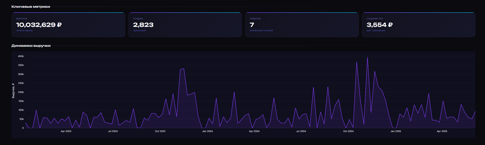
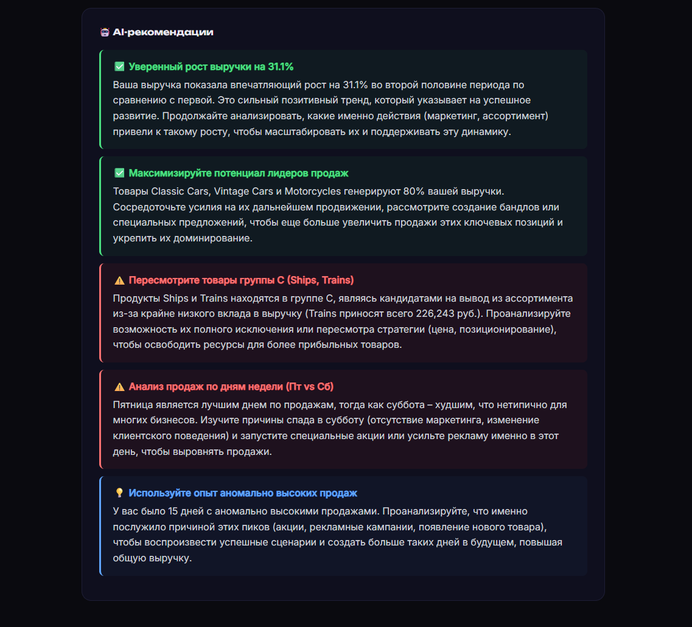

# Salytic 📊

> AI-анализ продаж для малого бизнеса. Загрузи CSV — получи инсайты и готовый отчёт за 30 секунд.


---

## 🚀 Демо




**Как выглядит:** загрузка CSV → KPI-карточки → графики динамики и товаров → AI-рекомендации → HTML-отчёт → платный доступ без ограничений.

---

## ✨ Что умеет

- Автоопределение структуры CSV (дата, товар, количество, сумма)
- Работа без ручной настройки данных
- KPI метрики: выручка, средний чек, транзакции, уникальные товары
- Динамика продаж и тренды
- Топ/анти-топ товаров
- ABC-анализ ассортимента
- Анализ по дням недели
- AI-рекомендации на русском (Gemini 2.5 Flash)
- Генерация HTML-отчёта
- Бесплатный демо-режим
- Платный доступ без ограничений

---

## 💼 SaaS модель

Salytic реализует базовую SaaS-монетизацию:

- 🔓 1 бесплатный анализ (demo mode)
- 🔒 Paywall после лимита использования
- 💳 Stripe Checkout для оплаты доступа
- 🔁 Webhook подтверждает оплату автоматически
- 👤 Учёт пользователей и usage tracking

---

## 🛠️ Стек

| Компонент | Технологии |
|---|---|
| UI | Streamlit |
| Аналитика | pandas, numpy |
| Графики | Plotly |
| AI | Gemini 2.5 Flash |
| Платежи | Stripe |
| Хранение | JSON storage (MVP) |

---

## 📁 Структура проекта

```text
salytic/
├── app.py              # основной интерфейс
├── analyzer.py         # аналитика продаж
├── llm.py              # Gemini API + fallback
├── report.py           # HTML отчёт
├── payments.py         # Stripe Checkout
├── webhook_server.py   # webhook обработчик оплаты
├── storage.py          # users / usage / paid access
├── requirements.txt
├── .env.example
└── screenshots/
```

---

## Локальный запуск

```bash
pip install -r requirements.txt
cp .env.example .env        # создай .env и вставь ключ
streamlit run app.py
```

🔑 Ключ Gemini API — бесплатно на [aistudio.google.com](https://aistudio.google.com/apikey).  
💳 Stripe ключи: из Stripe Dashboard (test mode)
---

## Формат CSV

Колонки определяются автоматически. Нужны любые 2–4 из них:

`дата` · `товар / наименование` · `количество` · `сумма / выручка`

Поддерживаемые разделители: `,` `;` `Tab` `|`
Кодировка: UTF-8, Windows-1251, Latin-1.

## 📞 Контакт

Telegram: @flufer_20
